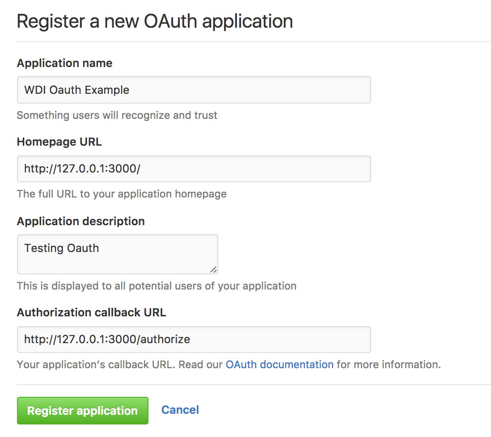
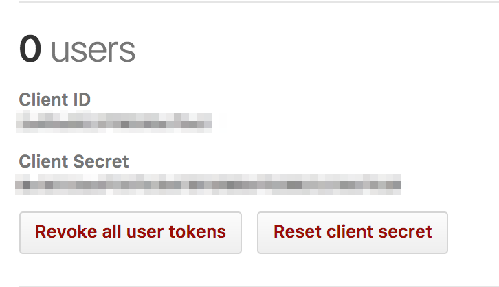

# Setup

Visit the [developer section](https://github.com/settings/developers) on your Github settings page.

Click on "Register a new application"



We can fill out this form anyway we like so let's add this:

- [ ] Fill out "Application name" with "WDI Oauth Example"

- [ ] Fill out "Authorization callback URL" with "http://127.0.0.1:3000/authorize"

# Keep it secret keep it safe



Take note of your Client ID and Client secret!

We'll need those for oAuth, but we don't want to share them on Github. We want to keep them
in our local environment and then access them via `process.env`

One way is to add them to our __Bash Profile__

```
$ echo 'export CLIENT_ID=VALUE' >> ~/.bash_profile
```
> After you set an environmental variable in your Bash Profile you'll have to restart your terminal!

We may work on multiple projects with different Client IDS and Secrets for the same APIs.
A better way would be to store the environmental variables per project using the `dotenv`
module.

# Dotenv

```
https://www.npmjs.com/package/dotenv
```

# Oauth Flow

1. The redirect

We send the user to Github to login

https://developer.github.com/v3/oauth/#1-redirect-users-to-request-github-access

Github sends us back a code to exchange

2. The access token 

https://developer.github.com/v3/oauth/#2-github-redirects-back-to-your-site

If everything works out we'll receive an access token we'll want to store in sesion

3. Sessions

https://github.com/expressjs/session

4. Talking with the API

Future requests can be made with the token in session. We'll just need to configure out requests right.

https://developer.github.com/v3/#user-agent-required
